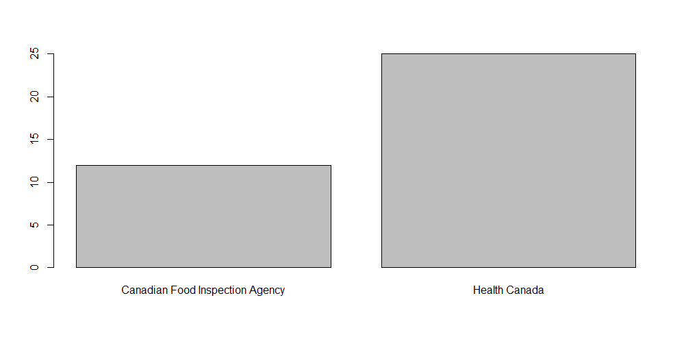

```{r, include = FALSE}
knitr::opts_chunk$set(
  collapse = TRUE,
  comment = "#>"
)
```

```{r setup}

```

Product recalls occur when a manufacturer requests the return of a defective/unsafe product from a consumer. These products can be potentially harmful to the consumer and leave the manufacturer legally liable for their harm.

Unfortunately, unless glued to the news, a consumer may miss this information and become harmed. It's important to stay informed, and this wrapper for the Canadian Recalls and Safety Alerts API allows anyone to do so.

<br>

There are three main functions wrapped in canrecall.

### recall_api

used to parse recall data. The result is a dataframe.

There are 4 filters:

- category: an integer variable where 1 = FOOD, 2 = VEHICLES, 3 = HEALTH PRODUCTS, 4 = CONSUMER PRODUCTS
  
- lang: a string variable as 'en' = English, 'fr' = French for response language
  
- lim: an integer variable to limit results to n
  
- search: a string variable to search the database for
  
So, for the most recent 10 results for peanuts, in english, the function would look like:

    recall_api('peanuts', 'en', 1, 10)

### recall_api_date
similar to recall_api, but meant to parse recall searches by date. The result is a dataframe

Here, there are 5 filters:

- category: an integer variable where 1 = FOOD, 2 = VEHICLES, 3 = HEALTH PRODUCTS, 4 = CONSUMER PRODUCTS
  
- lang: a string variable as 'en' = English, 'fr' = French for response language
  
- datestart: a string variable for the lower date bound of the search
  
- dateend: a string variable for the upper date bound of the search
  
- search: a string variable to search the database for

So, to find recall data for costco, in english, in from 2005 to 2015, the function would look like:

    recall_api('costco', 'en, datestart = '1/1/2005', dateend = '1/1/2015')

Aggregating this data into a chart showing number of recalls per department looks like the following:

    df <- df_date %>%
      group_by(department) %>%
      summarise(counts = n()) 
    
    barplot(df$counts, names.arg=df$department)



### recall_api_recent
regardless of filter, retrieves the 15 most recent recalls.

This function only requires 1 parameter:

- lang: a string variable as 'en' = English, 'fr' = French for response language
  
The following code will return the 15 most recent recalls for all categories (75 total):

    r recall_api_recent('en')


### Documentation for the wrapped API can be found at:

https://healthycanadians.gc.ca/connect-connectez/data-donnees/recall-alert-rappel-avis-eng.php


